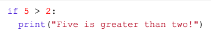
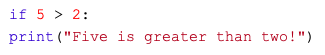
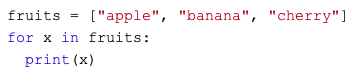
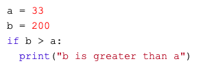

### Physically distant, socially connected 

---

<div class="border">
<iframe src="images/participant_map.html" allowfullscreen>
</iframe>
</div>

---

# Administratives

---

### Join the fun :iphone:

Mit Code **18 92 56** über: [https://www.menti.com](https://www.menti.com) 

Direkt: [https://www.menti.com/hcr7zidapk](https://www.menti.com/hcr7zidapk)

---

<div style='position: relative; padding-bottom: 56.25%; padding-top: 35px; height: 0; overflow: hidden;'><iframe sandbox='allow-scripts allow-same-origin' allowfullscreen='true' allowtransparency='true' frameborder='0' height='315' src='https://www.mentimeter.com/embed/e84d7dcf35ddfc9f46f6ce91440af5c7/90ac5677830b' style='position: absolute; top: 0; left: 0; width: 100%; height: 100%;' width='420'></iframe></div>

---

### Seminar Struktur
1. Teil: Online Fragebögen :heavy_check_mark:
2. Teil: Programmieren mit PsychoPy (live!)
3. Teil: Datenauswertungen (3. und 24. April)

---

## [Direction of travel](https://run.pavlovia.org/demos/glasgowfacematchingtask/html/) {data-background="images/direction_of_travel.jpg"}

---

## Reiseplan

| Block | Zeit 		| Station 							|
| -----	| --------------| ------------------------------------------------		|
| **1**	| 9.15--10.00	| Admin/Einführung, Installation, Experimentelles Design  	|
|	| 10.00--10.15 	| :coffee:							|
| **2**	| 10.15--12.00	| Python Basics, Demonstration					|
| 	| 12.00--13.00 	| :spaghetti:	  						|
| **3**	| 13.00--17.00 	| Individueller Workshop 					|

---

## Webinar Ablauf

- Vormittag: Tutorial, dringende Fragen im Zoom-Chat oder Menti stellen.
  - Bitte Kamera und Mikrofon ausschalten, ausser du sagst was :wink:
- Nachmittag: Individuelles Arbeiten/Ausprobieren, jede Menge Zeit individuelle Fragen zu beantworten

---

### Leistungsüberprüfung
1. Datenabgabe (individuell)

2. Erweiterung des Skripts (Kleingruppen von 2 bis 4 Personen)

-> Siehe *07 Leistungsüberprüfung* auf Moodle

---

<div style='position: relative; padding-bottom: 56.25%; padding-top: 35px; height: 0; overflow: hidden;'><iframe sandbox='allow-scripts allow-same-origin allow-presentation' allowfullscreen='true' allowtransparency='true' frameborder='0' height='315' src='https://www.mentimeter.com/embed/e84d7dcf35ddfc9f46f6ce91440af5c7/90ac5677830b' style='position: absolute; top: 0; left: 0; width: 100%; height: 100%;' width='420'></iframe></div>

---

## <span class="green">Let's get started</span> {data-background="https://media.giphy.com/media/AOSwwqVjNZlDO/giphy.gif"}

---

# Installation

---

## Open-source software
«Standing on the shoulders of giants.»

- Kollaboration
- Teilen und wiederverwenden
- **Hilfreiche Gemeinschaft**

---

## :four_leaf_clover:

Installation/Einrichtung von Software ist oft schwieriger und schlechter dokumentiert als blosse Verwendung.

---

## Aufgabe für die Windows Benutzer{data-background=#3c70b5}

Auf was musst du beim experimentellen Design achten?
 
-> Schreibe deine Punkte stichwortartig auf :pencil:

---

## macOS Catalina I

1. Lade den 64-bit Command-line Installer für Python 3.7 herunter:

   [https://repo.anaconda.com/archive/Anaconda3-2019.10-MacOSX-x86_64.sh](https://repo.anaconda.com/archive/Anaconda3-2019.10-MacOSX-x86_64.sh)

2. Öffne den Terminal (CMD + Space). 
3. Kopiere folgendes in den Terminal und drücke ENTER:
   
   ```bash ~/Downloads/Anaconda3-2019.10-MacOSX-x86_64.sh```

---

## macOS Catalina II

4. Folge der Installation.
5. :warning: WICHTIG: Auf die Frage ‘Do you wish the installer to initialize Anaconda3 by running conda init?’ sagen wir **no**!
6. Aktiviere Anaconda: 

   `source /Users/<Dein Benutzername>/anaconda3/bin/activate`

   (Bemerke: Dein Benutzername kannst du mit `whoami` erfragen)

---

## macOS Catalina III

7. Wir initialisieren die Änderung mit: 

   `conda init zsh`

8. Schliesse den Terminal. Öffnen ihn aber erneut und teste die Installation:

   `conda list`

9. Siehst du eine Liste der Module? :sparkles:

---

## Aufgabe für macOS Benutzer{data-background=#3c70b5}

Brainstorming: Was für Experimentideen kommen dir spontan in den Sinn? 
 
-> Schreibe deine Ideen stichwortartig auf :pencil:

---

## Windows 10

1. Lade den 64-bit graphical installer for Python 3.7 für Windows herunter: 

   [https://repo.anaconda.com/archive/Anaconda3-2019.10-Windows-x86_64.exe](https://repo.anaconda.com/archive/Anaconda3-2019.10-Windows-x86_64.exe)
   
2. Führe das heruntergeladene File aus um den Installationsprozess zu starten. 

3. :warning: WICHTIG: Unter Advanced Options markiere das Kästchen 'Add Anaconda to my PATH environment variable'.

4. Öffne einen Anaconda Terminal und teste die Installation mit:

   `conda list`

---

## Packages/modules (PsychoPy, etc.)

1. Python Package Index (PyPI): ["Cheese Shop"](https://www.youtube.com/watch?v=zB8pbUW5n1g)

   Via Terminal (macOS): 

   `/Users/<Username>/anaconda3/bin/python -m pip install <package name>`

   Via Anaconda Promt (win10): 

   `pip install <package name>`

2. Anaconda Distribution:
  
   `conda install <package name>`

---

## Last step :round_pushpin:

- Öffne Spyder (Editor, Entwicklungsumgebung (IDE))

  1. Im Terminal (macOS) oder Anaconda Promt (win10): `spyder`

  2. Über den Anaconda Navigator: Launch Spyder

---

# Experiment Design

---

### Computergestütztes Experimentieren

:::::::::::::: {.columns}
::: {.column width="50%"}

#### Pros

- Komplexe und dynamische Aufgabenstrukturen
- Präzise Messung und Kontrolle von Variablen
- Automatisierung

:::

::: {.column width="50%"}

#### Cons

- Unnatürlichkeit
- Abstraktion
- Schwierig zu standartisieren

:::
::::::::::::::

#Source: Merrie Brucks, *Computer-Controlled Experimentation in Consumer Decision Making and Judgment*; in Advances in Consumer Research Volume 17(1990)

---

### Auf was musst du beim experimentellen Design achten? :iphone:

Notiere deine Stichworte auf Menti. :pencil: 

Mit Code **62 55 20** via [https://www.menti.com](https://www.menti.com) 

Direkt: [https://www.menti.com/y9o8nnqyzt](https://www.menti.com/y9o8nnqyzt)

---

<div style='position: relative; padding-bottom: 56.25%; padding-top: 35px; height: 0; overflow: hidden;'><iframe sandbox='allow-scripts allow-same-origin allow-presentation' allowfullscreen='true' allowtransparency='true' frameborder='0' height='315' src='https://www.mentimeter.com/embed/8efdc5d9274d47a1fd5dcdac5d77ca9a/68ca315fdd2c' style='position: absolute; top: 0; left: 0; width: 100%; height: 100%;' width='420'></iframe></div>

---

### Experimentelles Design

- Orientierung/Information des Teilnehmenden
  - Datenschutz
- (Versteckte) Hypothesen
  - Messung der relevanten Variablen, Neutralität
- Benutzerfreundlichkeit
  - Dauer, Klarheit, Komfort (Tasten)
- Sweets :lollipop:
  - Erlebnis, Performance Feedback

---

### Habt ihr Fragen oder Mitteilungen? :iphone:

<div style='position: relative; padding-bottom: 56.25%; padding-top: 35px; height: 0; overflow: hidden;'><iframe sandbox='allow-scripts allow-same-origin allow-presentation' allowfullscreen='true' allowtransparency='true' frameborder='0' height='315' src='https://www.mentimeter.com/embed/8efdc5d9274d47a1fd5dcdac5d77ca9a/68ca315fdd2c' style='position: absolute; top: 0; left: 0; width: 100%; height: 100%;' width='420'></iframe></div>

---

## <span class="coffee">15'</span> &nbsp; &nbsp; &nbsp; &nbsp; &nbsp; &nbsp; &nbsp; &nbsp; &nbsp; &nbsp; {data-background="https://media.giphy.com/media/ZsbqQrUrzRtN6/giphy.gif"}

---

# Python Basics :snake:
 
---

## 
Python ist eine objekt-orientierte general-purpose Programmiersprache.

---

## Syntax: Datentypen 

| Name 			| Verwendung 			| Typ 			| Beispiel				|
| ----- 		| -----				| ---------		| ----------- 				|
| String		| Text				| str			| "Hi!" 				|
| Integer, Float	| Zahlen			| int, float		| 20, 4.5				|
| List	 		| Listen (ordered, mutable)	| list			| ["Good", "Morning", "Everybody"]	|
| Boolean 		| Wahrheitswerte		| bool			| True, False				|
| <span>&#8942;</span>	| <span>&#8942;</span>		| <span>&#8942;</span>	| <span>&#8942;</span>			|
| Tuple			| Listen (ordered, inmutable)	| tuple			| (1, 2)				|
| Dictionary		| Listen (unordered, mutable)	| dict			| {"a":1, "b": 2, "c": 3}		|

---

## Syntax: Datentyp Konversionen

- Ask for datatype: `type()`
- Any data type to integer: `int()`
- Integer to string: `str()`
- etc.

---

## Syntax: Variablen
- Variablen kreieren: 
  - `x = 'On our way'`
  - `y = 2`
  - `z = "PsychoPy!"`
- Variablen kombinieren:
  - `str_combo = x + y + z`
  - `int_combo = y + y`

---

## Syntax: = / ==
- Weise einer Variable einen Wert zu -> =
  - `x = 1`

- Überprüfe, ob zwei Ausdrücke den gleichen Wert ergeben -> ==
  - `1 == 2`
  - -> `False`

---

## Syntax: Kommentieren
- Zu oft unterschätzt:bangbang:

- Single line: 
	- \# Single line comment
- Multiple lines: 
	- """ [Comment 
	- over 
	- multiple 
	- lines] """

---

### Alles klar soweit? Gibt es Unklarheiten? :iphone:

Stelle deine Frage auf Menti.

Mit Code **46 17 32** über [https://www.menti.com](https://www.menti.com)

Direkt: [https://www.menti.com/x3rxatwnng](https://www.menti.com/x3rxatwnng)

---

<div style='position: relative; padding-bottom: 56.25%; padding-top: 35px; height: 0; overflow: hidden;'><iframe sandbox='allow-scripts allow-same-origin allow-presentation' allowfullscreen='true' allowtransparency='true' frameborder='0' height='315' src='https://www.mentimeter.com/embed/4b0f409444d7e4c987e564f0dc1b69d6/7d864000d06a' style='position: absolute; top: 0; left: 0; width: 100%; height: 100%;' width='420'></iframe></div>

---

## Syntax: Funktionen und Argumente

- Funktionen müssen installiert sein (via Terminal oder Anaconda Promt)

- Funktionen:
	- `import graph_tool` :rage:
	- `import random`
	- `import pandas as pd`
		- `df = pd.DataFrame()`
	- `from psychopy import visual`
		- `win = visual.Window()`

- Argumente:
	- `win = visual.Window(`
		- `size = [600,600],` 
		- `color = [-1,-1,-1],` 
		- `units = 'pix')`

---

## Syntax: Einschlag
- Indentation matters!
- Darstellung von Code Blöcken (z.B Loops, if statements, etc.)
- Mind. 1 Einzug und homogen innerhalb des Blocks

:::::::::::::: {.columns}
::: {.column width="50%"}

{.center width=100%}

:::

::: {.column width="50%"}

{.center width=100%}

:::
::::::::::::::

---

## Syntax: Iterations und conditionals

:::::::::::::: {.columns}
::: {.column width="50%"}

#### Loops

{.center width=70%}

:::

::: {.column width="50%"}

#### if statements

{.center width=70%}

:::
::::::::::::::

---

## Syntax: Methoden
- Wir verwenden Methoden auf Objekte
	- `msg = []`
	- `msg.append('Corona, go away!')`
 
---

### Quiz :iphone:

Mit Code **46 17 32** über [https://www.menti.com](https://www.menti.com)

Direkt: [https://www.menti.com/x3rxatwnng](https://www.menti.com/x3rxatwnng)

---

<div style='position: relative; padding-bottom: 56.25%; padding-top: 35px; height: 0; overflow: hidden;'><iframe sandbox='allow-scripts allow-same-origin allow-presentation' allowfullscreen='true' allowtransparency='true' frameborder='0' height='315' src='https://www.mentimeter.com/embed/4b0f409444d7e4c987e564f0dc1b69d6/7d864000d06a' style='position: absolute; top: 0; left: 0; width: 100%; height: 100%;' width='420'></iframe></div>

---

## Nützliche Links

- [https://stackoverflow.com](https://stackoverflow.com)
- [https://docs.python.org/3/tutorial/datastructures.html](https://docs.python.org/3/tutorial/datastructures.html)
- [https://www.djmannion.net/psych_programming/index.html](https://www.djmannion.net/psych_programming/index.html)

---

## <span class="google">Learning by doing, doing by googling </span> {data-background="https://media.giphy.com/media/50QSOZk8nzoIw/giphy.gif"}

---

# Demonstration

---

###

- Folge der Demonstration auf meinem Bildschirm. 
- Oder versuche direkt in Spyder mitzumachen.

---

# Workshop

---

## Aufgaben
- Alleine: Gehe selbständig durchs Skript und vergewissere dich, dass du verstehst was das Skript macht. 

- Stelle deine Fragen per Troubleshooting Forum auf Moodle, per E-Mail oder Anruf.

- Als Gruppe: Koordiniert in der Gruppe (Anruf oder E-Mail) wie und was ihr bei der Erweiterung des Skripts vornehmen wollt. Unterstützt euch gegenseitig.

---

## Buon appetito!{data-background="https://media.giphy.com/media/oFy0DysfL2nGG0W6Gr/giphy.gif"}
